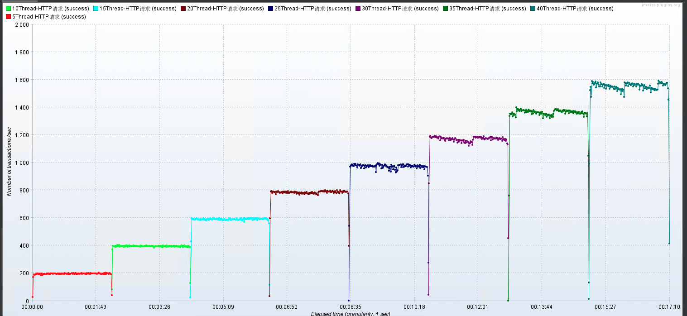
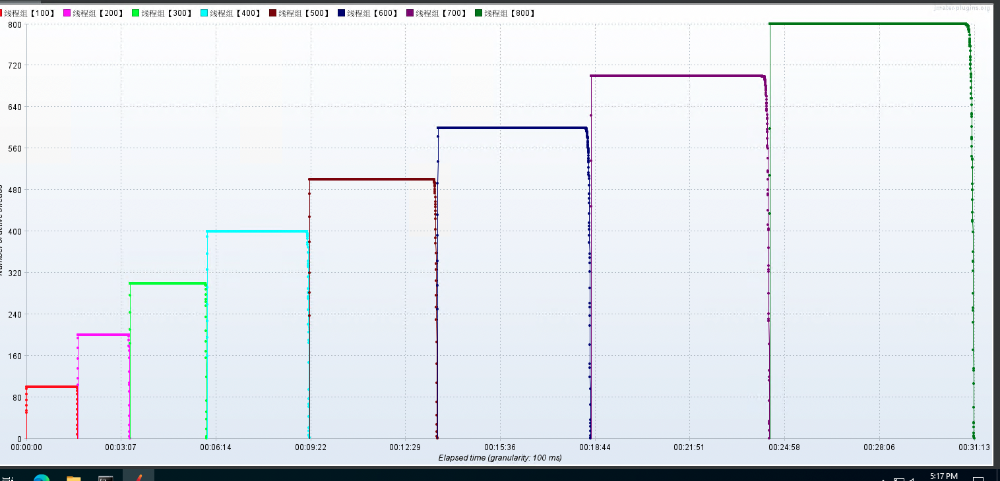

# 项目性能测试报告

## 01-测试目的

主要是测试不同应用服务器实现的性能。试图建立对各种不用 Java 应用服务器实现的理性认识。

## 02-测试工具与测试对象

Jmeter + prometheus/node_exporler 性能监控工具。

### 测试对象

* spring-boot tomcat 默认模式

* spring-boot tomcat nio2 模式

* spring-boot undertow 模式

* spring-boot webflux netty 模式

* netty 手写 http 模式

## 03-测试环境

### 3.1 环境

| 指标   | 参数   |
| ---- | ---- |
| 机器   | 4C8G |
| 集群规模 | 单机   |
| 版本   | 1.0  |
| 数据库  | 无    |

### 3.1 设置启动参数

```bash
export JAVA_HOME
export JRE_HOME=${JAVA_HOME}/jre
export CLASSPATH=.:${JAVA_HOME}/lib:${JRE_HOME}/lib


export SERVER_NAME="hero_web"
export JAVA="$JAVA_HOME/bin/java"
export BASE_DIR=`cd $(dirname $0)/.; pwd`
export DEFAULT_SEARCH_LOCATIONS="classpath:/,classpath:/config/,file:./,file:./config/"
export CUSTOM_SEARCH_LOCATIONS=${DEFAULT_SEARCH_LOCATIONS},file:${BASE_DIR}/conf/

JAVA_OPT="${JAVA_OPT} -server -Xms512m -Xmx512m -Xmn256 -XX:MetaspaceSize=128m -XX:MaxMetaspaceSize=320m"
JAVA_OPT="${JAVA_OPT} -XX:-OmitStackTraceInFastThrow -XX:+HeapDumpOnOutOfMemoryError -XX:HeapDumpPath=${BASE_DIR}/logs/java_heapdump.hprof"
JAVA_OPT="${JAVA_OPT} -XX:-UseLargePages"
JAVA_OPT="${JAVA_OPT} -jar ${BASE_DIR}/${SERVER_NAME}*.jar"
JAVA_OPT="${JAVA_OPT} ${JAVA_OPT_EXT}"

JAVA_OPT="${JAVA_OPT} --spring.config.location=${CUSTOM_SEARCH_LOCATIONS}"
if [ ! -d "${BASE_DIR}/logs" ]; then
  mkdir ${BASE_DIR}/logs
fi
echo "$JAVA ${JAVA_OPT}"

if [ ! -f "${BASE_DIR}/logs/${SERVER_NAME}.out" ]; then
  touch "${BASE_DIR}/logs/${SERVER_NAME}.out"
fi

echo "$JAVA ${JAVA_OPT}" > ${BASE_DIR}/logs/${SERVER_NAME}.out 2>&1 &
nohup $JAVA ${JAVA_OPT} hero_web.hero_web >> ${BASE_DIR}/logs/${SERVER_NAME}.out 2>&1 &
echo "server is starting，you can check the ${BASE_DIR}/logs/${SERVER_NAME}.out"
```

## 04-测试场景

测试场景一般情况下是都是最重要接口：验证 5 种实现在低延迟场景下低表现，以及 3 种实现在高延迟场景下表现。

**情况01-模拟低延时场景** 用户访问接口并发逐渐增加的过程。接口的响应时间为20ms，线程梯度：5、10、15、20、25、30、35、40个线程，5000次;

- 时间设置：Ramp-up period(inseconds)的值设为对应线程数
- 测试总时长：约等于20ms x 5000次 x 8 = 800s = 13分

**情况02-模拟高延时场景** 用户访问接口并发逐渐增加的过程。接口的响应时间为500ms，线程梯度：100、200、300、400、500、600、700、800个线程，200次; 

- 时间设置：Ramp-up period(inseconds)的值设为对应线程数的1/10；
- 测试总时长：约等于500ms x 200次 x 8 = 800s = 13分


## 06-下面会有很多 `boring` 测试过程图，建议直接省流看结论部分 [点击跳转](#06-测试结论)
## 05-核心接口的测试结果

### 一、低延迟接口

#### spring-boot tomcat 默认模式


#### spring-boot tomcat nio2 模式





#### spring-boot undertow 模式


#### spring-boot webflux netty 模式


#### netty 手写 http 模式


### 二、高延迟接口

#### spring-boot tomcat 默认模式





#### spring-boot tomcat nio2 模式


#### spring-boot undertow 模式


## 06-测试结论

1. 低延迟测试时，各种实现明显可以看出没有出现性能拐点，猜测可能是测试方案的并发数设计的过于保守。
2. 测试到 undertow 模式时，明显发现到 25 并发时上不去了，cpu 负载和使用率也明显高于前两个小伙伴？如此异常表现值得下面在深入研究下，本测试限于时间紧张，没有进行重测。
3. `spring-boot webflux netty`有点太出彩了， cpu 负载更低！响应时间抖动小。
   
   
4. 直接用 netty 写到 http 服务端，居然比 spring-boot webflux 的实现的性能表现还差一点，这说明代码还有需要优化的部分。比如跑的过程中，就观察到 `tcp_tw` 超过了 5k，需要尝试下压一压 timewait 是否有更加的性能表现。
5. tomcat nio2 在优化了模型和设置堆资源的相关参数之后，对响应时间对改善确实明显。有图为证：
   
   
   
   同时 CPU 负载上来了：
   
   
   
   时间有限，未测试原模型直接优化参数后是什么情况，有点遗憾，将来有时间了再补上。
6. undertow 高延迟居然有大量的 fail request，而且响应时间也和 tomcat 默认配置差不多。我的 undtertow 这是怎么了？这玩意儿是我设置参数配置的不正确吗？
   
   
   
   
   
   看起来没啥毛病啊。