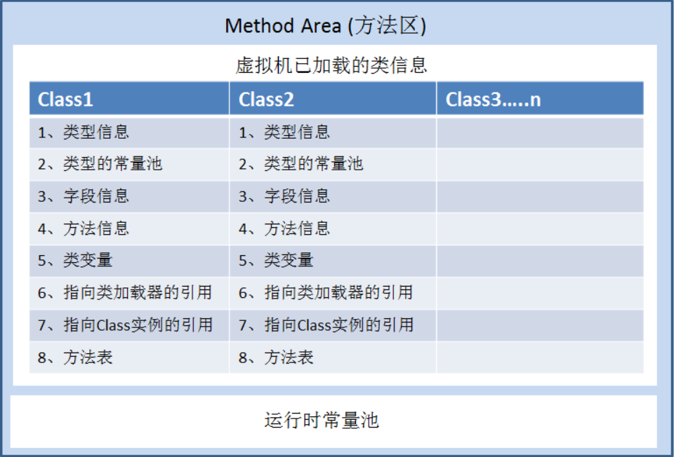
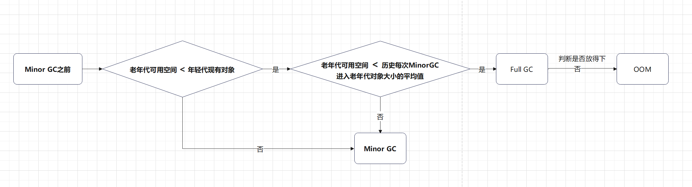
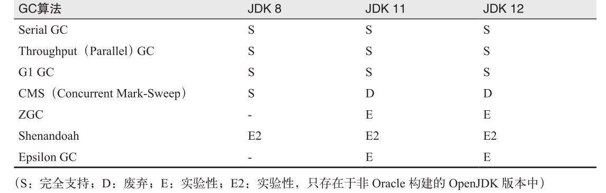

#1) Java 运行时数据区（内存区域）

JVM 定义了若干程序运行时，会用到的运行时数据区，有些会随着虚拟机启动时启动、停止而销毁;有些会随着线程启动而启动、停止而销毁。

## PC （Program Counter）寄存器

用来记录线程当前方法的字节码指令的地址

## Java 虚拟机栈

每一个 java 线程都有自己私有的一块栈空间用于存放栈帧（Frame）。栈帧存储了方法的局部变量表、操作数栈、动态连接和方法返回地址。
每个Java方法在执行的时候都会创建一个栈帧。当前正在执行的方法的栈帧成为当前栈帧。可以通过 -Xss 指定线程的栈大小。默认是 1m。

## Java 堆

1. 堆是所有 Java 线程共有的一块可供存放对象的内存区域。堆在虚拟机启动时被创建。可以通过 -Xms 、 -Xmx 来指定堆分配的初始大小和最大大小。
2. 堆内存根据`分代收集理论`，分成了 `新生代`【绝大多数对象都是早生熄灭的】 和 `老年代` 【熬过多次垃圾回收剩下的对象都是难以消亡的】。
3. 由于新生代对象的特性【绝大多数对象都会被回收】，所以新生代对象采用 `Copying 拷贝算法` 效率更加高效。因此新生代会有两个 `Survivor` 区用来轮换的存储不能被回收的幸存者对象。
4. 新创建的 Java 堆对象一般会放入 `新生代` 的 `eden` 区。（`eden` 放的下、或者新生代垃圾回收后放得下）

## 方法区

方法区存储 Java 编译后代码的存储区域。他存储类的结构信息，比如： 运行时常量池、字段和方法数据、构造函数和普通方法的字节码内容，以及一些类、实例、接口的初始化用到的特殊方法。

方法区的实现在历代 jdk 中有两种实现类型#

* PermGen 永久代 —— 与主内存堆分离的特殊堆空间。它还包含有关字节码、名称和 JIT 信息的数据。在 Java 7 之前，字符串池也是该内存的一部分。
* Metaspace 元空间 —— 从Java 8 版本开始；它取代了旧的 PermGen 内存空间。Metaspace 属于堆外内存，不占用 Java 进程的应用堆内存。

### 方法区存储的数据类型：

1. Class 类定义信息
2. 运行时常量池
3. JIT 编译后的本地代码

### 运行时常量池

存储 class 文件中每一个类或者接口的常量池表的运行时表示。类似于传统语言的符号表（symbol table）。

## 本地方法栈

Java 虚拟机实现可能会用到传统的栈来支持 native 方法的执行，这种栈就是本地方法栈。

## 直接内存

直接内存（Direct Memory）并不是虚拟机运行时数据区的一部分，而是通过 native 函数直接分配堆外内存。他能显著提高 IO 场景的内存使用性能，减少了一次内存复制的过程。

#2) Java 对象的一生

## 对象的创建过程

1. new 指令发起对象的实例创建。
2. 查询运行时常量池，该类是否被加载过。
3. 如果没有被加载过，请先加载。
4. 加载过类定义后，开始为类实例分配内存空间，初始零值。
5. 对象头的相关必要信息的设置。
6. 对类进行初始化（init）操作。

## 对象的内存分配方式

1. 指针碰撞 —— 用于连续的新生代内存分配
2. 空闲列表 —— 用于不连续的老年代内存的分配

## 对象的销毁过程

1. 如果对象在GCRoots分析算法为不可达对象时
2. 进入第一次标记
3. 再进行第一次标记后，筛选的条件是此对象是否有必要执行finalize（）方法。当对象没有覆盖finalize（）方法，或者finalize（）方法已经被虚拟机调用过，虚拟机将这两种情况都视为“没有必要执行”。
4. 在 finalize() 方法中没有重新与引用链建立关联关系的，将被进行第二次标记。
5. 第二次标记成功的对象将真的会被回收，如果失败则继续存活。

## 对象的 2 种访问方式

1. 句柄 —— 如果使用句柄的话，那么Java堆中将会划分出一块内存来作为句柄池，reference中存储的就是对象的句柄地址，而句柄中包含了对象实例数据与类型数据各自的具体地址信息。
2. 直接指针 —— 如果使用直接指针访问，那么Java堆对象的布局中就必须考虑如何放置访问类型数据的相关信息，而reference中存储的直接就是对象的地址。

## 为什么需要内存担保？

1. 当新生代无法分配足够的内存给新对象，会发生新生代的 Minor GC。但如果老年代可用内存已经小于新生代全部对象大小，在极端情况下就有可能装不下。
1. 这个时候，需要判断下老年代可用内存大小是否小于之前每次 minorGc 进入老年代对象的大小。
   1. 如果是，就行进 Fullgc, 再判断是否放得下，如果放不下就 oom
   2. 如果否，就会进行 minorgc
      1. 将存活对象大于 Surivor 区的但是小于老年代可用内存的，直接进入老年代。（ <- 这就是内存担保）
      2. 如果存活对象小于 Surivor 区就往 Survior 区搬
      3. 如果存活对象大于 Surivor 区，也大于老年代内存，就只能进行 FullGc 了。 
      4. 如果 fullgc 失败，就 oom

# 3) 垃圾收集算法

## Serial 垃圾回收器

Serial 垃圾回收器是最简单的回收器。如果应用程序运行在客户端（运行 32 位 JVM 的
Windows）机器上或者单处理器的机器上，那么它会是默认的回收器。曾经，Serial 垃圾
回收器似乎注定要被淘汰，但是容器化改变了这一点：只有一个核心（甚至是以两个 CPU
形式出现的超线程核心）的虚拟机和 Docker 容器让这个算法又有了使用的意义。

Serial 垃圾回收器使用单线程来处理堆。它在处理堆时会停止所有的应用程序线程（不管
是 Minor GC 还是 Full GC）。在 Full GC 期间，它将完全压缩老年代。

使用 -XX:+UseSerialGC 标志可以开启 Serial 垃圾回收器（尽管在可能用到它的情况下，它
通常已经默认开启了）。注意，与大多数 JVM 标志不同，将标志中的加号换成减号（设定
-XX:-UseSerialGC）并不会禁用 Serial 垃圾回收器。在 Serial 垃圾回收器是默认垃圾回收器
的系统中，禁用它需要设定另外一个垃圾回收器。

## Throughput 收集器

Throughput 垃圾回收器是任何有两个或者多个 CPU 的 64 位机器的默认垃圾
回收器。Throughput 垃圾回收器使用多个线程回收新生代，这让 Minor GC 比使用 Serial 垃
圾回收器时快。它同样使用多个线程处理老年代。因为它使用多个线程，所以 Throughput
垃圾回收器又常常被称为并行回收器（parallel collector）。

Throughput 垃圾回收器在 Minor GC 和 Full GC 时都会停止所有的应用程序线程，在 Full
GC 时会完全压缩老年代。在大多数会使用到的情况下，它是默认的垃圾回收器，不需要
显式开启。如果有必要开启，可以使用 -XX:+UseParallelGC 标志。

注意，老版的 JVM 需要分别对新生代和老年代开启并行回收，所以你可能会看到有的地
方使用了 -XX:+UseParallelOldGC 标志。这个标志已经过时了（不过它还可以用，如果你因为某些原因非得使用它，可以禁用这个标志，只对新生代进行并行回收）。

## CMS 收集器

CMS 垃圾回收器是第一个并发垃圾回收器。像其他算法一样，CMS 使用多个线程来执行
回收操作，会在 Minor GC 的过程中停止所有的应用程序线程。
CMS 垃圾回收器自 JDK 11 被正式废弃，而且不鼓励在 JDK 8 中使用。从实际的角度来
看，CMS 的主要缺陷是它不能在后台处理过程中压缩堆。如果堆变得碎片化（这很可能在
某些时候发生），那么 CMS 必须停止所有的应用程序线程并压缩堆，这就违背了使用并发
垃圾回收器的初衷。因为这个原因和 G1 GC 的出现，CMS 不再被推荐。
CMS 可以通过 -XX:+UseConcMarkSweepGC 标志开启，它的默认值是 false。CMS 曾经也要求
设置 -XX:+UseParNewGC 标志（否则新生代会被单个线程回收）
，后来这个标志也被淘汰了。

## G1 收集器

G1 GC（垃圾优先垃圾回收器）使用并发回收策略来以最小的停顿回收堆。在两个或多个
CPU 的 64 位机器上，它是 JDK 11 和之后版本的默认垃圾回收器。
G1 GC 将堆划分为多个 Region（区域或分区），但它仍然认为堆有两代。一些区域组成了
新生代，回收新生代时 G1 GC 还是会暂停所有应用程序线程，并将所有活跃的对象移动到
老年代或 Survivor 空间（此时使用了多个线程）。
在 G1 GC 中，老年代是由后台线程处理的，大多数工作不需要停止应用程序线程。老年代
被划分为多个区域，G1 GC 可以通过将对象从一个区域复制到另一个区域来清理老年代的
对象，这意味着它在正常处理过程中对堆（至少是一部分）进行了压缩。尽管这还是有可
能碎片化，但这帮助 G1 GC 避免了一些情况。
避免 Full GC 的代价是消耗 CPU 周期。在应用程序线程运行的同时，G1 GC 用来处理老年
代的多个后台线程必须有可用的 CPU 周期。
G1 GC 可以通过 -XX:+UseG1GC 标志开启。在大多数情况下，它是 JDK 11 的默认垃圾回收
器。它在 JDK 8 中也能使用——特别是在 JDK 8 的后期版本中，因为这些版本已经从之后
的版本中向后移植了很多重要的 bug 修复和性能增强。不过，在深入探索 G1 GC 时，你会
发现，JDK 8 中的 G1 GC 缺少了一个主要的性能特性，这个特性不适合该版本。

## ZGC 和 Shenandoah

第一个是 Z 垃圾回收器（Z garbage
collector，ZGC）， 第 二 个 是 Shenandoah 垃 圾 回 收 器。ZGC 在 JDK 11 中 首 次 出 现。
Shenandoah GC 在 JDK 12 中首次出现，但现在已经被向后移植到了 JDK 8 和 JDK 11 中。

要使用这两个回收器，必须先设定 -XX:+UnlockExperimentalVMOptions 标志（默认情况下是
false）
，然后设定 -XX:+UseZGC 或 -XX:+UseShenandoahGC 来替换其他 GC 算法。

**垃圾回收器这块的内容和老师教授的有较大出入，需要后续自己验证后再做修改。**

