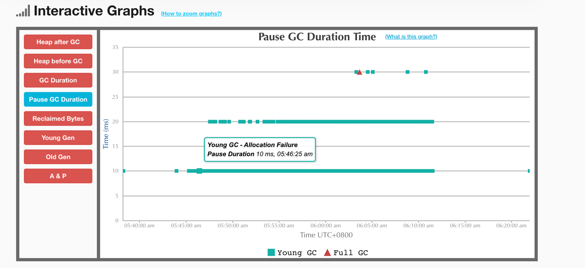
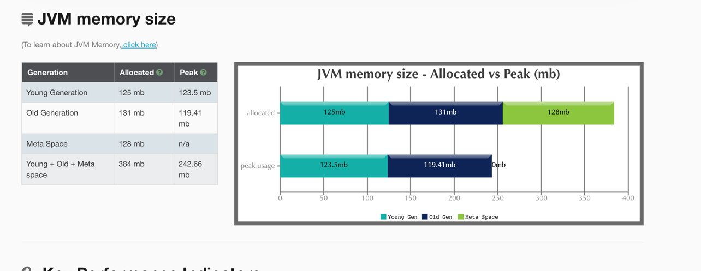

# 吞吐量优先，低延时接口(PS-PO)

输出文件 [gc-ps-po-fast-th.log](./gc-ps-po-fast-th.log)

## GC easy 报告

### 内存规划

需要设置 -XX:MaxMetaspaceSize=128m 否则报告的 metaspace 会大于 `-XX:MetaspaceSize=128m` 期望的 128m

### 总体指标

### 其他

## jmeter 报告

## jvm 报告

# CMS,低延迟接口

输出文件： [gc-parnew-cms.log](./gc-parnew-cms.log)

## gc easy 报告

gc easy 对 meta space 峰值识别出现问题

gc 平局时间和最大暂停时间优于 ps-po 模式

## jmeter 报告

## jvm 报告

# 大内存收集器，低延时接口(G1)

输出文件 [gc-g-one-fast.lo](./gc-g-one-fast.log)

## gc easy 报告

**没有出现 full gc 了，最大暂停时间很小！**

## jvm 报告

## jmeter 报告

# 吞吐量优先，高延迟接口(PS-PO)

输出文件 [gc-ps-po-slow.log](gc-ps-po-slow.log)

## gc easy 报告

## jvm 报告

## jmeter 报告

# 响应时间优先，高延迟接口(CMS)

输出文件 [gc-parnew-cms-slow.log](./gc-parnew-cms-slow.log)

## gc easy 报告

TODO:: 使用次数受限，暂时没法获取了.

## jvm 报告

## jmeter 报告

