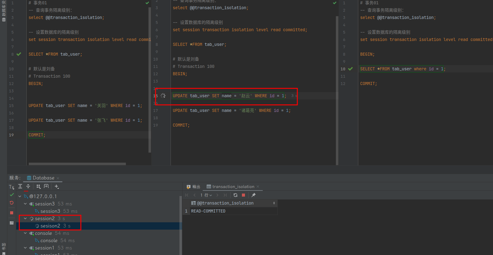

# 第七周

## 题目 01- 完成 ReadView 案例，解释为什么 RR 和 RC 隔离级别下看到查询结果不一致

### 完成案例 01- 读已提交 RC 隔离级别下的可见性分析

#### 准备阶段

#### 执行规划

#### 步骤一 —— 开启三个事务

#### 步骤二 —— session1 干活儿

查到张飞，事务内。

#### 步骤三 —— session3 查询

**依旧看到是刘黄叔**

#### 步骤四 —— session2 执行

爱的转圈圈，等待 session1 提交呢！！！

#### 步骤五 —— session1 提交

session1 commit 后， session2 的 爱的甜甜圈就结束了，更新成功，在session2 中查询以下：

赵老板在 session 2 的当前事务里面上线了。

这个时候可以查到两条事务在线：

session3 这个时候可以查到 session1 的提交：

#### 步骤五 —— session2 继续干活

session2 更新了两次后，session3 依然查询到的是：

#### 步骤六 —— session2 结束

session3 能查到 session2 的 更新数据了。

### 案例 02- 可重复读 RR 隔离级别下的可见性分析

步骤类似，只是在 session1 提交后， session3 仍然查询到的是事务开始时的 `刘皇叔`

session2 提交后， session3 依旧查询到事务开始时的 刘皇叔

可见，确实可能存在一个 Read View 的玩意儿，让其一直读取这历史版本的记录内容。

## 题目 02- 什么是索引？

索引是加速数据库存储数据查询的一种数据结构。

优点： 可以加速数据查询的速度。

缺点： 数据更新时需要维护索引结构与数据。

索引分类：

* 单列索引 —— 索引中只有一个列，可分为以下类别
  * 主键索引
  * 普通索引（辅助索引）
  * 唯一索引
  * 全文索引

* 组合索引 —— 使用2个以上的字段创建的索引

### 索引创建的原则

1. 频繁出现在where 条件字段，order排序，group by分组字段
2. select 频繁查询的列，考虑是否需要创建联合索引（覆盖索引，不回表）
3. 多表join关联查询，on字段两边的字段都要创建索引

### 使用索引的注意事项

1. 表记录很少不需创建索引
2. 一个表的索引个数不能过多
3. 频繁更新的字段不建议作为索引
4. 区分度低的字段，不建议建索引
5. 在InnoDB存储引擎中，主键索引建议使用自增的长整型，避免使用很长的字段
6. 不建议用无序的值作为索引
7. 尽量创建组合索引，而不是单列索引
8. 规避索引失效的使用方式
   1. 全值匹配我最爱，最左前缀要遵守
   2. 带头大哥不能死，中间兄弟不能断
   3. 索引列上不计算，范围之后全失效
   4. Like百分写最右，覆盖索引不写星
   5. 不等空值还有OR，索引失效要少用

### 如何知道 SQL 是否用到了索引

使用 explain 做 sql 的执行计划，看其结果是否出现了全表扫描这种，就是没有使用到索引。或者是其他不合理、效率不高的索引使用方式。

### 请你解释一下索引的原理是什么？

通过特殊的数据结构达到更快的数据检索效率，降低检索的时间复杂度，用空间换取时间的策略。比如可以通过树型结构来存储数据的索引，将时间复杂度降到 O（logN） 的级别。总体的设计思路就是更少的磁盘寻址，顺序的按照块的数据读取，提升磁盘数据检索的效率。

### 为什么要用 B+Tree ？

对比其他数据结构，比如 红黑树，B+Tree 的树深度更小，所以磁盘寻址的次数更少。同时树叶子节点可以存储更多的有序的检索数据，便于磁盘的顺序读取和范围检索。

对比 B Tree， B+Tree 只在叶子节点存储数据值，而且叶子节点还通过双向链表进行连接，方便跨节点的范围检索的寻址。大大提升了范围检索跨节点时的寻址效率。

## 题目 03- 什么是 MVCC？

MVCC全称叫多版本并发控制，是RDBMS常用的一种并发控制方法，用来对数据库数据进行并发访问，实现事务。核心思想是读不加锁，读写不冲突。

MVCC 的实现依赖与Undo日志 与 Read View 。

Redo日志记录了事务的行为，可以很好地通过其对页进行“重做”操作。但是事务有时还需要进行回滚操作，这时就需要undo。因此在对数据库进行修改时，InnoDB存储引擎不但会产生Redo，还会产生一定量的Undo。这样如果用户执行的事务或语句由于某种原因失败了，又或者用户用一条Rollback语句请求
回滚，就可以利用这些undo信息将数据回滚到修改之前的样子。在多事务读取数据时，有了Undo日志可以做到读不加锁，读写不冲突。

Redo日志有默认字段和可见字段，默认字段是隐藏的列。默认字段最关键的两个列，一个保存了行的事务ID，一个保存了行的回滚指针。

ReadView是张存储事务id的表，主要包含当前系统中有哪些活跃的读写事务，把它们的事务id放到一个列表中。结合Undo日志的默认字段【事务trx_id】来控制那个版本的Undo日志可被其他事务看见。结合Undo日志的默认字段【事务trx_id】来控制那个版本的Undo日志可被其他事务看见。

ReadView有四列数据：

* m_ids：表示在生成ReadView时，当前系统中活跃的读写事务id列表
* m_low_limit_id：事务id下限，表示当前系统中活跃的读写事务中最小的事务id，m_ids事务列表
  中的最小事务id
* m_up_limit_id：事务id上限，表示生成ReadView时，系统中应该分配给下一个事务的id值
* m_creator_trx_id：表示生成该ReadView的事务的事务id

判断可见性步骤如下：

* 如果被访问版本的 trx_id 属性值，小于ReadView中的事务下限id，表明生成该版本的事务在生成 ReadView 前已经提交，所以该版本可以被当前事务访问
* 如果被访问版本的 trx_id 属性值，等于ReadView中的 m_creator_trx_id ，可以被访问。
* 如果被访问版本的 trx_id 属性值，大于等于ReadView中的事务上限id，在生成 ReadView 后才产生的数据，所以该版本不可以被当前事务访问。
* 如果被访问版本的 trx_id 属性值，在事务下限id和事务上限id之间，那就需要判断是不是在m_ids 列表中：
  * 如果在，说明创建 ReadView 时生成该版本的事务还是活跃的，该版本不可以被访问；
  * 如果不在，说明创建 ReadView 时生成该版本的事务已经被提交，该版本可以被访问。

循环判断Undo log中的版本链某一的版本是否对当前事务可见，如果循环到最后一个版本也不可见的话，那么就意味着该条记录对该事务不可见，查询结果就不包含该记录。

